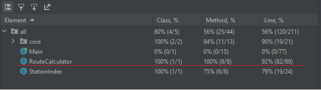

# Задача
- Напишите тесты на все методы класса RouteCalculator в проекте SPBMetro.
- С помощью тестов и отладки исправьте ошибку, которую вы найдёте в проекте SPBMetro.
- Добиться 100%-го покрытия методов класса RouteCalculator.

### Покрытие методов RouteCalculator:
<h2 align="center">

</h2>
